# Arch + Hyprland Dotfiles (Mocha Neon)

My Arch Linux + [Hyprland](https://hypr.land) desktop in the Catppuccin Mocha palette
(mauve accent), plus a terminal-first dev environment. One script sets up the whole thing.

## Screenshots

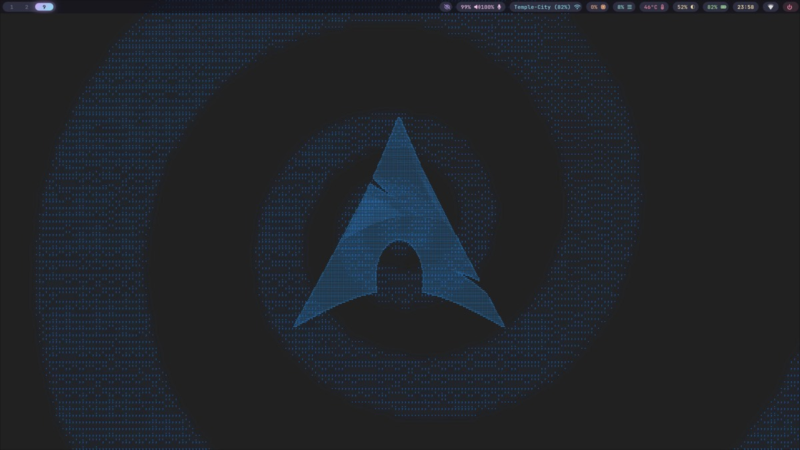

| eww dashboard (Super+Grave) | Keybind cheatsheet (Super+/) |
|:--:|:--:|
| 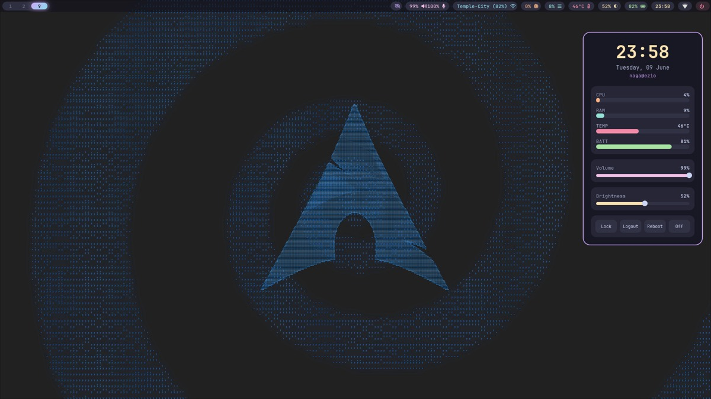 | 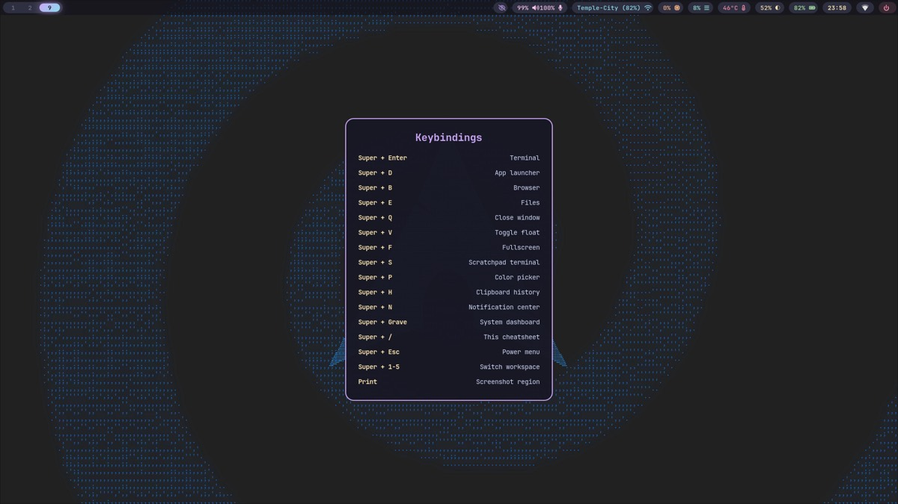 |
| **App launcher (wofi)** | **Power menu (wlogout)** |
| 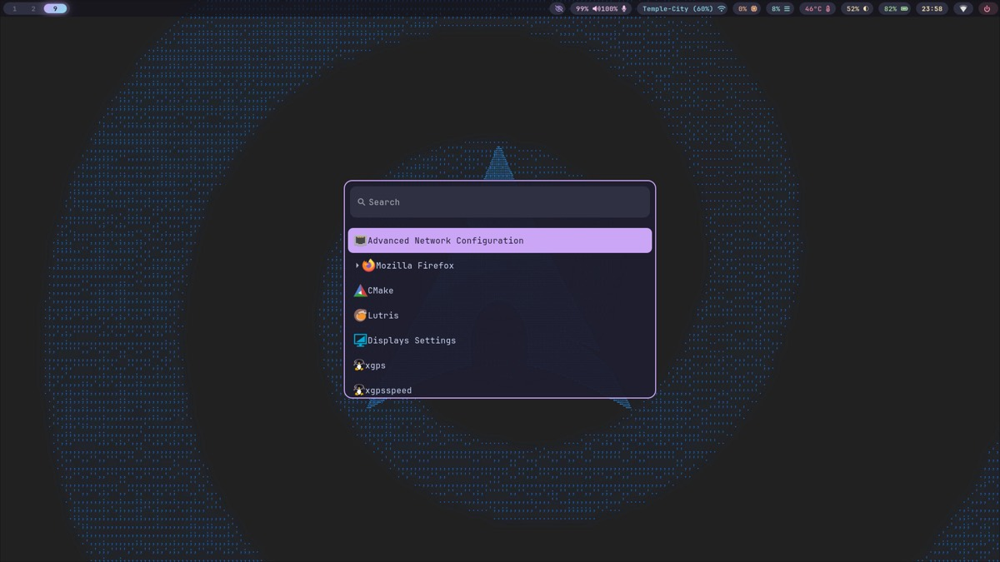 | 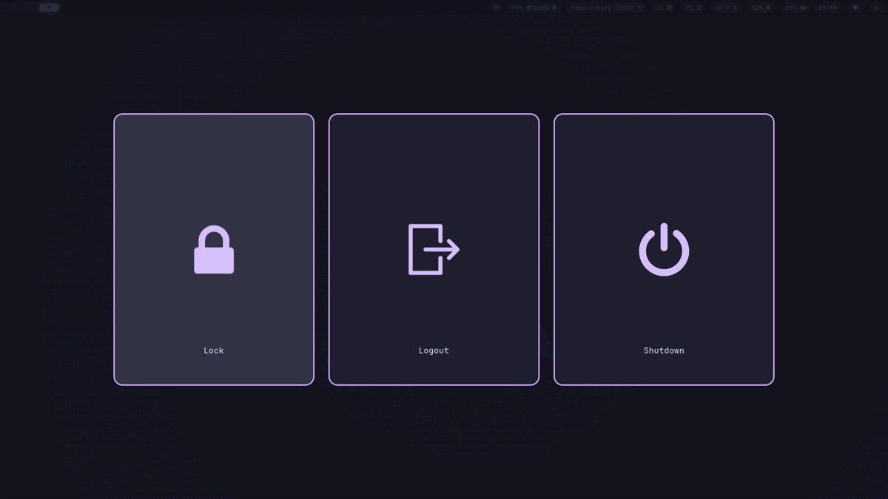 |
| **System monitor (btop)** | **Notifications (swaync)** |
| 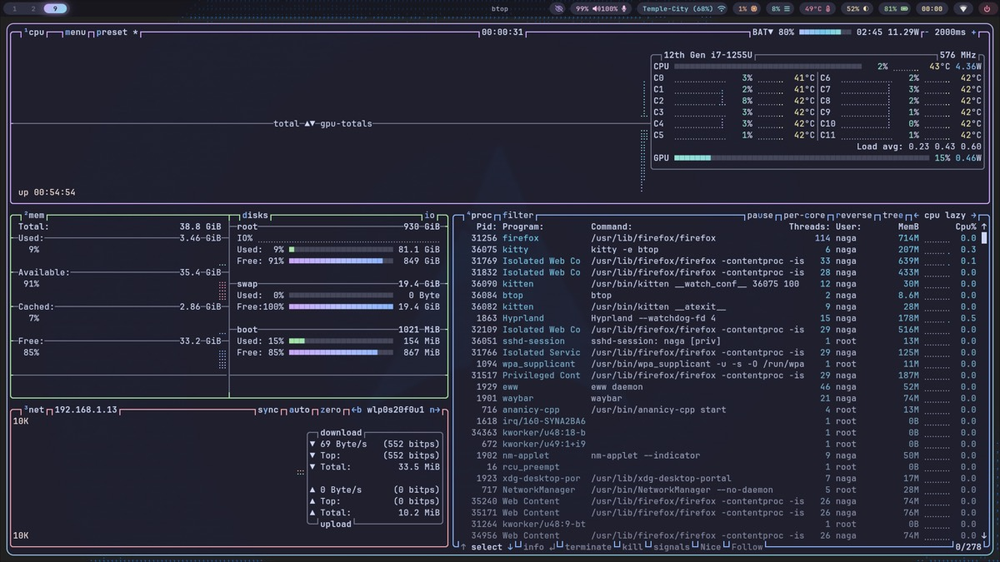 | 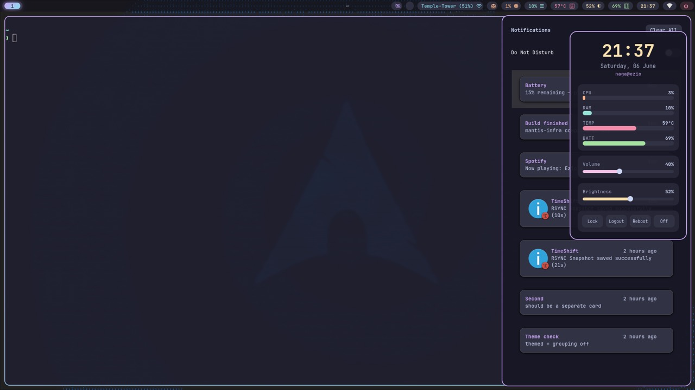 |
| **Neovim dashboard** | **Neovim editing (LSP + Treesitter)** |
| 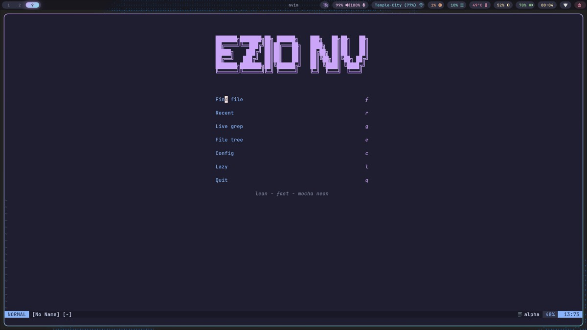 | 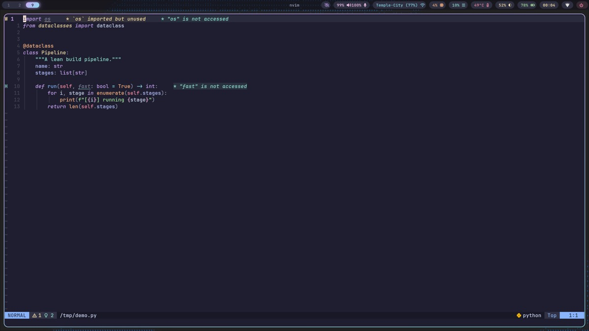 |
| **File manager (Thunar)** | **Terminal greeting (fastfetch)** |
| 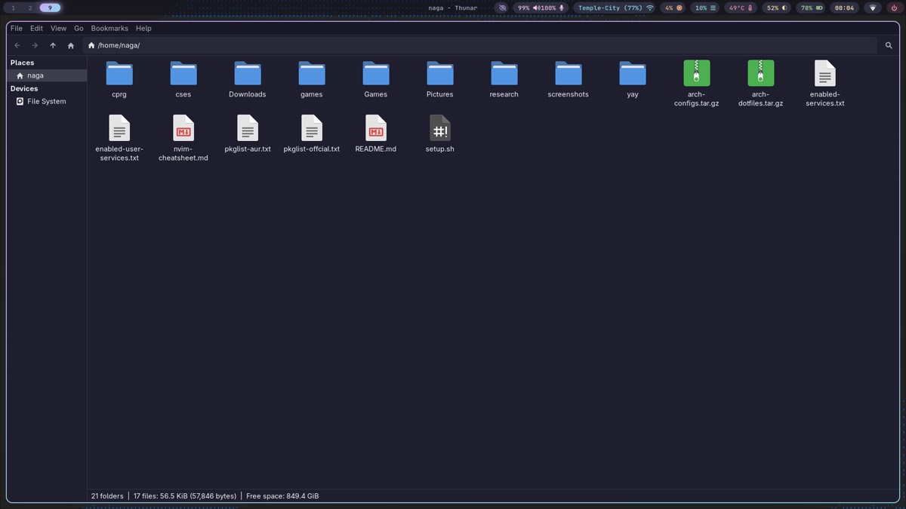 | 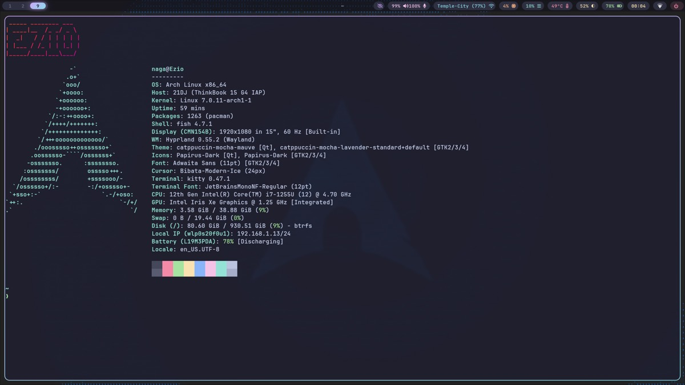 |
| **Audio visualizer (cava)** | **Lock screen (hyprlock)** |
| 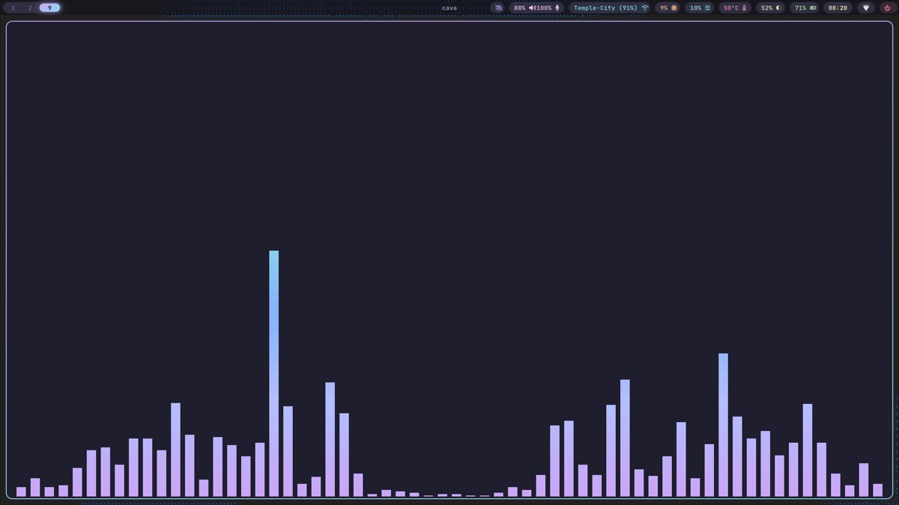 | 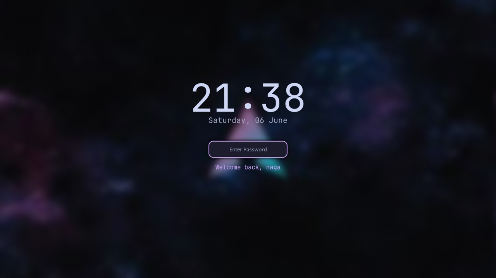 |

## What you get

- Hyprland compositor with Waybar (island bar), swaync notifications, an eww dashboard,
  hyprlock / hypridle, and wofi / wlogout.
- Catppuccin Mocha theming across GTK, Qt (Kvantum), the terminal, and the editor.
- A terminal dev environment: Neovim (LSP, Treesitter, completion, dashboard, a Space+?
  cheat sheet), uv for Python, fnm for Node, and a fast CLI kit (ripgrep, fd, fzf, bat,
  eza, zoxide, lazygit, git-delta).
- Thunar file manager, kitty terminal, fish shell with a starship prompt.
- Light performance and power tuning: zram-friendly sysctls, tlp, thermald on Intel,
  ananicy-cpp.

## Quick start (one command)

Requirements: a working Arch Linux install (base system, a user account, internet).
You do not need Hyprland pre-installed; the script installs it.

```bash
# grab the setup script
curl -fsSLO https://raw.githubusercontent.com/Nagavignesh1729/dotfiles/main/setup.sh

# read it first (always review a setup script before running it), then run it
less setup.sh
bash setup.sh
```

The script installs the packages (from the included pkglist files), clones these dotfiles
as a bare repo and applies them to your home directory (backing up anything it would
overwrite), sets up fish, Node and the Neovim plugins, and enables a few services.

After it finishes, reboot, log into Hyprland, run `nwg-displays` to set your monitors,
and you are done.

## Manual install

If you would rather do it by hand, or the script trips on something:

```bash
# packages (or: sudo pacman -S --needed - < pkglist-offcial.txt)
sudo pacman -S --needed hyprland waybar swaync wofi wlogout kitty fish starship \
  neovim ripgrep fd fzf bat eza zoxide lazygit git-delta uv fnm thunar tumbler \
  kvantum qt6ct nwg-look nwg-displays papirus-icon-theme tree-sitter-cli \
  ttf-jetbrains-mono-nerd pipewire wireplumber wl-clipboard grim slurp tlp

# AUR (needs a helper such as yay): eww, ananicy-cpp, the gtk theme, etc.
yay -S --needed - < pkglist-aur.txt

# apply the dotfiles (bare-repo method)
git clone --bare https://github.com/Nagavignesh1729/dotfiles.git $HOME/.dotfiles
alias config='git --git-dir=$HOME/.dotfiles --work-tree=$HOME'
mkdir -p ~/.config-backup
# back up ALL conflicting files (not just dotfiles) then check out
config checkout 2>&1 | awk '/would be overwritten/{f=1;next} /^[^ \t]/{f=0} f&&NF{gsub(/^[ \t]+/,"");print}' \
  | while read f; do mkdir -p ~/.config-backup/"$(dirname "$f")"; mv ~/"$f" ~/.config-backup/"$f"; done
config checkout
config config --local status.showUntrackedFiles no

# shell and toolchains
chsh -s /usr/bin/fish
fnm install --lts && fnm default lts-latest
nvim --headless "+Lazy! sync" +qa
```

## Hardware notes

These configs were built on an Intel/Lenovo laptop, so adjust a few things on other hardware:

- CPU microcode: use `amd-ucode` instead of `intel-ucode` on AMD.
- `thermald` is Intel only; the script skips it automatically on AMD.
- Monitor layout (`~/.config/hypr/monitors.conf`) is machine specific. Regenerate it with
  `nwg-displays` after install.
- GPU drivers (`mesa`, `vulkan-*`) depend on your card.

## Plymouth boot splash (optional)

A Catppuccin-dark boot splash (a recolored `spinner`). `setup.sh` offers to do this
automatically (the "boot splash" prompt). To set it up by hand:

```bash
# 1. install plymouth
sudo pacman -S plymouth

# 2. make the theme from the stock spinner, recolored to Catppuccin base
sudo cp -r /usr/share/plymouth/themes/spinner /usr/share/plymouth/themes/catppuccin-mocha
th=/usr/share/plymouth/themes/catppuccin-mocha
sudo sed -i -e 's/^BackgroundStartColor=.*/BackgroundStartColor=0x1e1e2e/' \
            -e 's/^BackgroundEndColor=.*/BackgroundEndColor=0x1e1e2e/' \
            -e 's/^ProgressBarBackgroundColor=.*/ProgressBarBackgroundColor=0x45475a/' \
            -e "s#^ImageDir=.*#ImageDir=$th#" "$th/spinner.plymouth"
sudo mv "$th/spinner.plymouth" "$th/catppuccin-mocha.plymouth"

# 3. add the 'plymouth' hook in /etc/mkinitcpio.conf, right after udev or systemd:
#    HOOKS=(base systemd plymouth autodetect ... )   <- edit this line

# 4. add 'splash quiet' to your kernel cmdline:
#    systemd-boot: append to the 'options' line in /boot/loader/entries/*.conf
#    GRUB: add to GRUB_CMDLINE_LINUX_DEFAULT in /etc/default/grub,
#          then: sudo grub-mkconfig -o /boot/grub/grub.cfg

# 5. apply + rebuild the initramfs
sudo plymouth-set-default-theme -R catppuccin-mocha
```
Reboot to see it. If `mkinitcpio` complains about a missing `fsck` helper on a Btrfs
root, that warning is harmless (remove `fsck` from HOOKS if you want it gone).

## Key bindings (Hyprland)

| Key | Action |
|---|---|
| Super + Return | terminal (kitty) |
| Super + E | file manager (Thunar) |
| Super + D | app launcher (wofi) |
| Super + Grave | eww dashboard |
| Super + / | keybind cheatsheet |
| Super + S | scratchpad |
| Super + P | color picker |
| Super + W | next wallpaper (smooth transition) |
| Super + Shift + P | performance toggle (effects on/off) |

In Neovim the leader is Space: `Space ff` find files, `Space fg` grep, `Space e` file
tree, `Space ?` cheat sheet. The full sheet is at `~/nvim-cheatsheet.md`.

## Updating (how the bare repo works)

The git database lives in `~/.dotfiles` and your home directory is the work-tree. Use the
`config` alias (set in `config.fish`) instead of `git`; it tracks the live files in place.

```bash
config add ~/.config/whatever
config status
config commit -m "what changed"
config push
```

A normal project (say `~/code/x` with its own `.git`) is driven by plain `git` and stays
completely separate, so there is no conflict.

## No secrets here

Nothing sensitive is committed: no SSH or GPG keys, no GitHub or gh token, no atuin key,
no browser data, no passwords. If you fork this, keep it that way. Never `config add`
`~/.ssh`, `~/.config/gh`, `~/.config/atuin`, `~/.st/`, or any env or token file.

## Credits

[Catppuccin](https://catppuccin.com), [Hyprland](https://hypr.land),
[lazy.nvim](https://github.com/folke/lazy.nvim), and the Arch and r/unixporn community.
Issues and PRs welcome.
